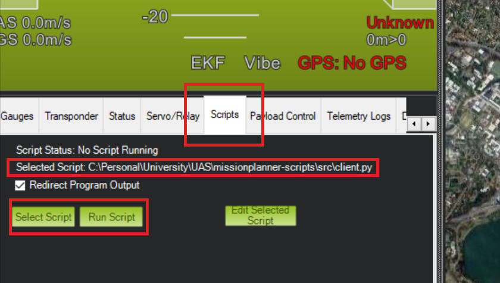

# MissionPlanner Scripts

## Table of Contents

1. [Instructions](#instructions)
2. [Endpoints](#endpoints)
3. [Sockets](#sockets)

# Instructions

## SITL & MissionPlanner

1. In order to run SITL on your local machine, you will need to have Docker installed. For installation instructions, refer to the
following:

    - [Windows Installation](https://docs.docker.com/desktop/install/windows-install/)
    - [MacOS Installation](https://docs.docker.com/desktop/install/mac-install/)

2. You will also need to have MissionPlanner installed on your system. Refer to installation steps [here](https://ardupilot.org/planner/docs/mission-planner-installation.html).

3. Once you have Docker, you will need to pull the [SITL image from DockerHub](https://hub.docker.com/r/ubcuas/uasitl/tags). To do this, run the Docker application then run the following command (where `X.X.X` is the desired ArduPilot version - this should match what is/will be running on the drone):

    - ArduPlane (VTOL):
        - x86: `docker pull ubcuas/uasitl:plane-X.X.X`
        - ARM64: `docker pull ubcuas/uasitl:plane-arm-X.X.X`
    - ArduCopter (Quadcopter):
        - x86: `docker pull ubcuas/uasitl:copter-X.X.X`
        - ARM64: `docker pull ubcuas/uasitl:copter-arm-X.X.X`

    If everything goes correctly, running `docker image ls` should contain an entry for `ubcuas/uasitl`.

4. Run one of the following commands to get SITL running. Refer to [the documentation](https://github.com/ubcuas/UASITL) for more customization:

    x86: `docker run --rm -d -p 5760:5760 --name acom-sitl ubcuas/uasitl:[plane/copter]-X.X.X`

    ARM64: `docker run --rm -d -p 5760:5760 --name acom-sitl ubcuas/uasitl:[plane/copter]-arm-X.X.X`

5. Next, open MissionPlanner. The first thing you will want to do is make sure that the dropdown in the top right of the UI is configured to `TCP` as shown here:

    <p align="center">
        
    </p>

6. Press the `Connect` Button to the right of that pane. You will be prompted with two inputs: one for hostname, and another for the remote port you want to use. Enter the following for each:

    - Hostname: `localhost`
    - Remote Port: `5760`

7. If you have completed all of the above steps you should be ready to use SITL with MissionPlanner. If you see a drone show up on the map then you should be ready to go.

## Using MissionPlanner-Scripts

1. Install required dependencies:

    ```c
    poetry install --no-root
    ```

2. Launch the application:

    On Windows (Powershell)
    ```
    poetry run python .\src\main.py --dev --port=9000
    ```

    On MacOS
    ```
    poetry run python src/main.py --dev --port=9000
    ```

    The server will listen on the specified port (default 9000) for HTTP requests, and will use port 4000 to communicate with MissionPlanner.

3. Start the client inside MissionPlanner:

    Navigate to the 'Scripts' tab and select `client.py` to run, the press 'Run Scripts' to start.

    

### Using Tests

To run tests, you must have the Docker image running (uasitl:copter).
Then, enter the src directory and run the `pytest` command via Poetry:

```
    cd src
```

```
    poetry run pytest
```

# Endpoints

## (GET) /queue

Returns the current list of waypoints in the queue, in the order of their names. GCOM stores longitudes and latitudes internally, so we really only need the order of names of waypoints.

Waypoints that have been passed and removed from the queue, obviously, should not be displayed here either.

Altitude is measured relative to sea level.

Example response body:

```json
[
    {
        "id": 1,
        "name": "Alpha",
        "longitude": 38.83731,
        "latitude": -20.48321,
        "altitude": 50.7
    },
    {
        "id": 2,
        "name": "Beta",
        "longitude": 38.83731,
        "latitude": -20.48321,
        "altitude": 50.7
    }
]
```

## (POST) /queue

POST request containing a list of waypoints with names and longitude, latitude, and altitude values. If altitude is nil, carry on with the same altitude as you had last waypoint.

Previous queue should be overwritten if there is already one in place.

Longitude, name, and latitude must not be null/empty. Returns a Bad Request status code and error message in that case.
Longitude and latitude in degrees, altitude in meters.

Altitude is measured relative to sea level.

Return status code 200 if successfully POSTed.

Example request body:

```json
[
    {
        "id": 1,
        "name": "Alpha",
        "longitude": 38.83731,
        "latitude": -20.48321,
        "altitude": 50.7
    },
    {
        "id": 2,
        "name": "Beta",
        "longitude": 38.83731,
        "latitude": -20.48321,
        "altitude": null
    }
]
```

## (GET) /clear

Call this endpoint to clear the current contents of the queue. The drone will no longer pursue the mission, as all waypoints have been removed.

An alternative to this endpoint is to call `POST /queue` with an empty queue as the body, since it overwrites the mission.

## (GET) /status

GET request returns the aircraft status.
Velocity in m/s. Altitude in meters and is relative to sea level. Longitude, latitude, heading in degrees.

Example response:

```json
{
    "velocity": 22.2,
    "longitude": 38.3182,
    "latitude":  82.111,
    "altitude": 28.1111,
    "heading": 11.2,
    "batteryvoltage": 1.5
}
```

## (GET) /lock

Stops the aircraft from moving based on the Mission Planner scripts' waypoint queue loading functionality, maintaining the queue internally.
Return Bad Request if the aircraft is already locked,
or the queue is empty.

It is still be possible to run (POST) /queue while the aircraft is locked.

This won't literally lock the aircraft either, i.e.
we can still manually set waypoints with Mission Planner. This just pauses the loading functionality of the queue program. If currently moving toward a waypoint, stop moving toward it by removing it.

## (GET) /unlock

Resume moving the aircraft based on the currently stored queue. Returns a Bad Request status code and an error message if the aircraft is already unlocked.

## (POST) /takeoff

POST request containing an altitude that is measured relative to sea level.

The altitude cannot be null. Returns a Bad Request status code and error message in that case. Altitude is in meters. Return status code 200 if successfully POSTed.

Example request body:

```json
{
    "altitude": 50.7
}

```

## (POST) /rtl

Aircraft returns to home waypoint and lands (return-to-launch). Returns a Bad Request status code and error message if the drone could not execute the operation.

## (GET) /land

Aircraft stops at its current position and lands. Returns a Bad Request status code and error message if the drone could not execute the operation.

## (POST) /home

POST request containing a waypoint whose longitude, latitiude and altitiude will be the basis for the new home waypoint. All other fields will be ignored.

Longitude, latitude and altitude must not be null/empty. Returns a Bad Request status code and error message in that case.

Longitude and latitude in degrees.
Altitude in meters and is relative to sea level.
Return status code 200 if successfully POSTed.

Example request body:

```json
{
    "id": 1,
    "name": "Alpha",
    "longitude": 38.83731,
    "latitude": -20.48321,
    "altitude": 50.7
}
```

## (PUT) /flightmode

This PUT request allows you to modify various settings for a drone:

- **Flight Mode:** Change the active flight mode by setting the `flight_mode` key to one of the following: `loiter`, `stabilize`, `auto`, or `guided`.
- **Drone Type:** Modify the drone configuration by setting the `drone_type` key to either `vtol` or `plane`.
- **Altitude Reference:** Update the altitude measurement standard by setting the `altitude_standard` key to `AGL` (Above Ground Level) or `ASL` (Above Sea Level).

Each of these key-value pairs is optional; you can include any, all, or none of them in the JSON request body.

### Example Request Body

```json
{
    "flight_mode": "loiter",
    "drone_type": "vtol",
    "altitude_standard": "ASL"
}
```

# Sockets

A connection can be established through a Socket endpoint (set through command line argument, port 9001 by default). An example Node.js client has been provided in `testing/socket.js` that establishes a connection, and continually sends/recieves status information every 500ms.

## Events (server-side)

The server is listening for the following events:

### connect

Socket client connects. Outputs to console to confirm connection.

### disconnect

Socket client disconnects. Outputs to console to confirm disconnection.

### message

On recieving a `message` event, the server emits another `message` event in response, carrying a JSON containing basic drone status information. JSON Response template:

```json
{
    "velocity": 22.2,
    "longitude": 38.3182,
    "latitude":  82.111,
    "altitude": 28.1111,
    "heading": 11.2,
    "batteryvoltage": 1.5
}
```

## Heartbeat

We are using the Flask SocketIO library for our implementation. By default, the server pings the client every 25 seconds.
